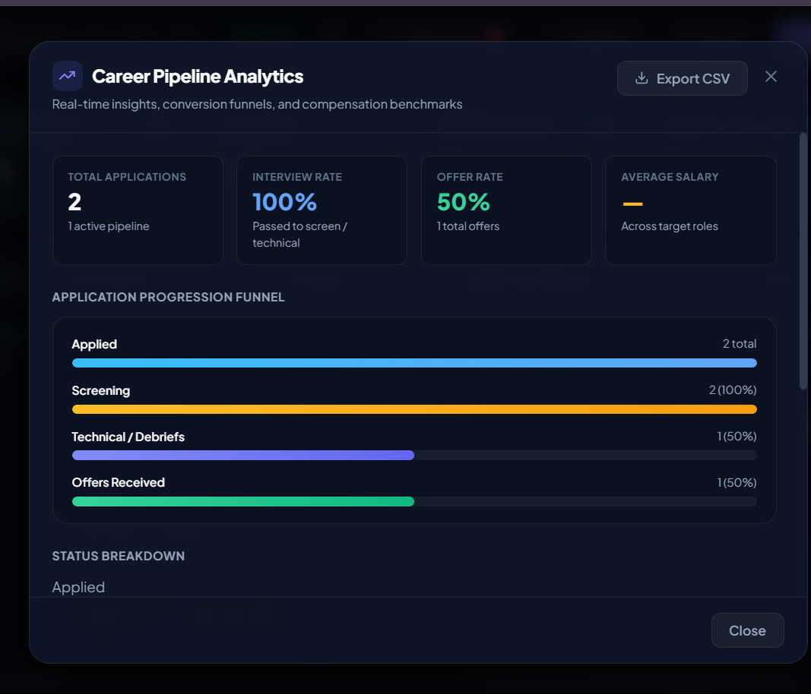
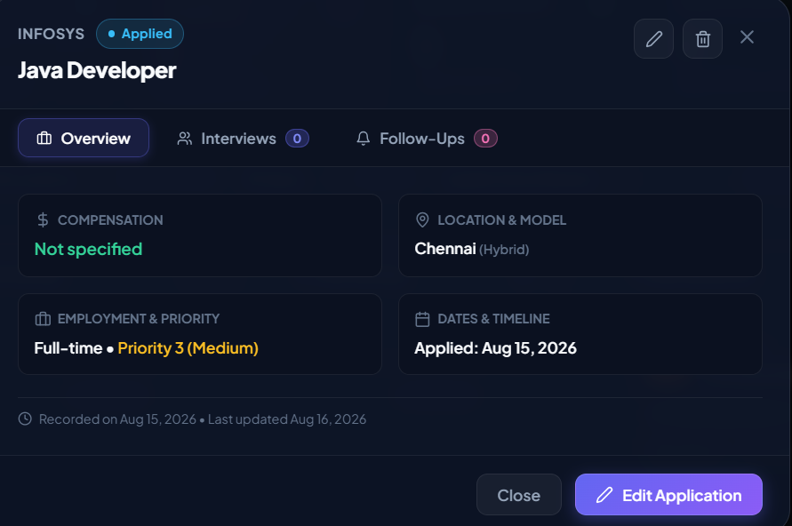
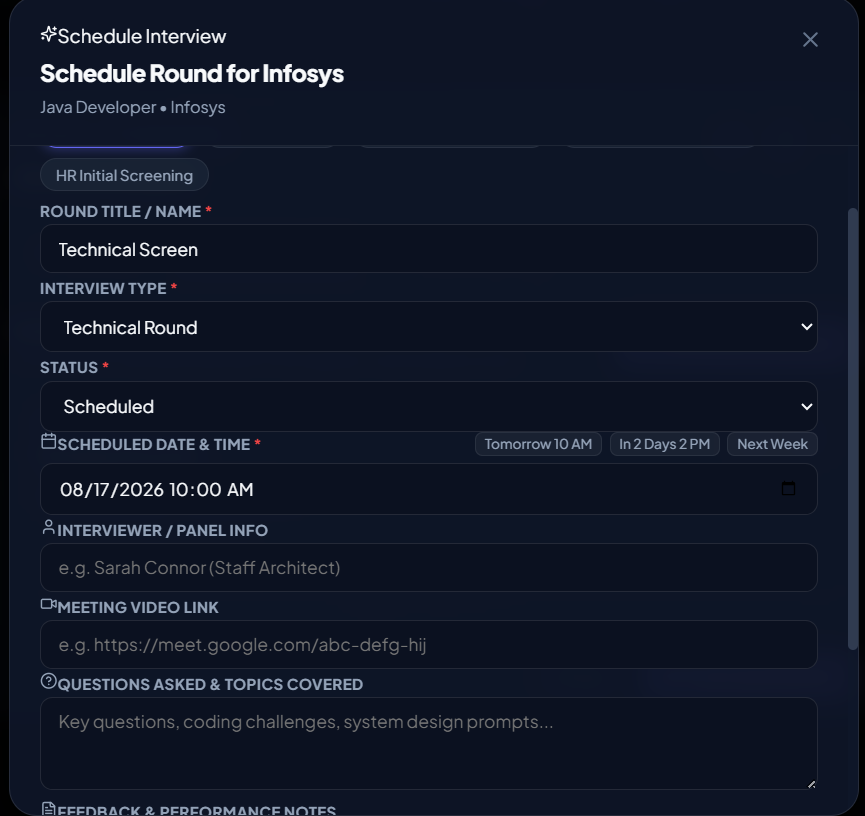
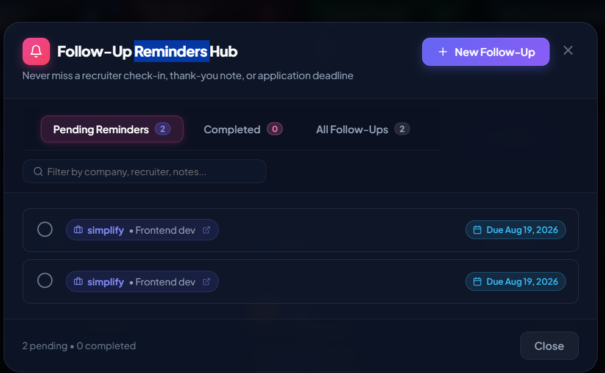
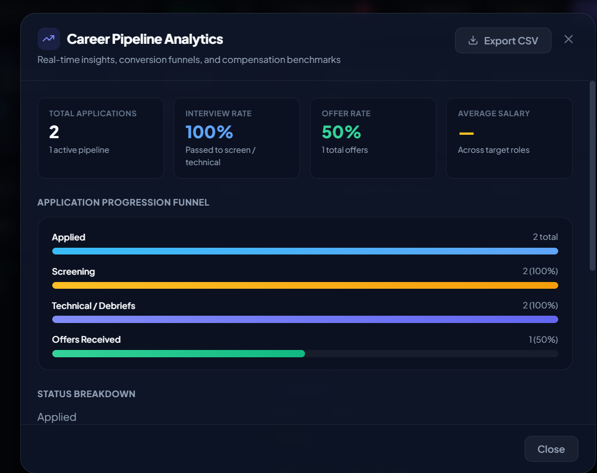

# 💼 JobTrack - Intelligent Career Application & Pipeline Platform

[](https://adoptium.net/)
[](https://spring.io/projects/spring-boot)
[](https://react.dev/)
[](https://vitejs.dev/)
[](https://www.docker.com/)
[](https://www.mysql.com/)
[](https://github.com/features/actions)
[](https://junit.org/junit5/)

JobTrack is an enterprise-grade, containerized, full-stack career pipeline and job application tracking platform. Designed for modern engineering professionals and job seekers, JobTrack delivers interactive Kanban pipelines, multi-round interview tracking, follow-up reminder hubs, salary analytics, and RFC-4180 CSV export with secure JWT user isolation.

---

## ✨ Features Showcase

### 📊 Real-Time Pipeline Metrics & Ribbon
- **Live Status Telemetry**: Instant counters for total tracked opportunities, active interviews, screening rounds, and offers secured.
- **Salary Intelligence**: Computes average target compensation across active applications with midpoint range aggregation and currency awareness.

### 📋 Interactive Multi-View Dashboard
- **Kanban Board**: Drag-and-drop status progression through `APPLIED`, `SCREENING`, `INTERVIEWING`, `OFFER`, `REJECTED`, and `WITHDRAWN`.
- **Responsive Table & Grid Views**: Multi-column sorting by applied date, company name, priority level, and target salary.
- **Search & Filtering**: Multi-criteria search by company, job role, location, notes, workplace model (Remote / Hybrid / On-site), and employment type.

### 🗓️ Multi-Round Interview Management
- **Round-by-Round Scheduling**: Tracks HR Screening, Technical, System Design, Behavioral, and Managerial debriefs.
- **Interview Detail Logging**: Captures meeting links, interviewer contacts, technical questions asked, and debrief notes with full edit/delete lifecycle.

### 🔔 Follow-Up Reminders Hub
- **Action Tracking**: Never miss a thank-you note, portfolio submission, or offer response with dedicated due date indicators and overdue warning alerts.
- **One-Click Completion**: Interactive checkbox toggle to mark actions as pending or completed with immediate state synchronization.

### 📈 Career Pipeline Analytics
- **Progression Funnel**: Visual stage-by-stage conversion funnel showing screening-to-interview and interview-to-offer percentage rates.
- **Workplace & Salary Distribution**: Visual breakdown of remote vs. hybrid models and target compensation bands.

### 📥 RFC-4180 Compliant CSV Export
- **One-Click Export**: Downloads all user-isolated application data with UTF-8 BOM encoding for seamless Microsoft Excel and Google Sheets compatibility.

---

## 📸 Application Screenshots

### Dashboard



### Job Application Management



### Interview Tracking



### Follow-Up Management



### Career Analytics



---

## 🏗️ Architecture Overview

The application follows a decoupled, production-ready multi-tier architecture:

```
JobTrack/
├── .github/
│   └── workflows/
│       └── ci.yml                 # Automated CI/CD (Maven tests, Vite build, Docker images)
├── backend/
│   ├── src/                       # Spring Boot 3.3.4 (Java 21 LTS) REST API
│   │   ├── main/
│   │   │   ├── java/com/jobtrack/ # Controllers, Services, Security, Repositories, DTOs
│   │   │   └── resources/         # application.properties (parameterized env config)
│   │   └── test/                  # 70 Unit, Integration & Security Tests (MockMvc, H2)
│   ├── Dockerfile                 # Multi-stage build (Maven 3.9 -> Eclipse Temurin 21 JRE)
│   ├── .dockerignore
│   └── pom.xml
├── frontend/
│   ├── src/                       # React 18 SPA + Modern Glassmorphism UI (Lucide icons)
│   ├── nginx.conf                 # Production Nginx reverse proxy & SPA fallback
│   ├── Dockerfile                 # Multi-stage build (Node.js 20 -> Nginx 1.27 Alpine)
│   ├── .dockerignore
│   └── package.json
├── docker-compose.yml             # Orchestration: MySQL 8.0, Backend, Frontend
├── .env.example                   # Environment configuration template
├── .env                           # Local environment overrides (git-ignored)
└── README.md
```

---

## 🚀 Quick Start with Docker Compose

### 1. Configure Environment Variables
Copy the template to initialize your local `.env`:
```bash
cp .env.example .env
```

| Variable | Description | Default / Example |
| :--- | :--- | :--- |
| `DB_NAME` | MySQL database name | `jobtrack_db` |
| `DB_USER` | MySQL non-root username | `jobtrack_user` |
| `DB_PASSWORD` | MySQL user password | `jobtrack_pass` |
| `DB_ROOT_PASSWORD` | MySQL root administrative password | `root_secret_pass` |
| `DB_PORT` | Host port for MySQL access | `3306` |
| `BACKEND_PORT` | Host port for Spring Boot REST API | `8080` |
| `FRONTEND_PORT` | Host port for React/Nginx Web App | `3000` |
| `JWT_SECRET` | 256-bit secret key for HMAC-SHA256 tokens | `JobTrackSecretKeyForJwtAuthenticationMustBeAtLeast...` |
| `JWT_EXPIRATION_MS`| JWT token validity duration in milliseconds | `86400000` (24h) |

### 2. Start the Application Stack
Build images and start all containerized services:
```bash
docker compose up -d --build
```

### 3. Check Container Status & Health
```bash
docker compose ps
```

### 4. View Service Logs
```bash
# Stream all service logs
docker compose logs -f

# Stream specific service logs
docker compose logs -f backend
docker compose logs -f frontend
docker compose logs -f mysql
```

### 5. Stop the Application Stack
```bash
# Stop containers (preserves database data volume)
docker compose down

# Stop containers and remove persistent database volume
docker compose down -v
```

---

## 🌐 Application URLs

Once the stack is running, access the services via:

| Service / Component | URL | Description |
| :--- | :--- | :--- |
| **Frontend Web App** | [http://localhost:3000](http://localhost:3000) | React SPA served by Nginx |
| **Backend REST API** | [http://localhost:8080](http://localhost:8080) | Spring Boot REST API |
| **Swagger UI Docs** | [http://localhost:8080/swagger-ui.html](http://localhost:8080/swagger-ui.html) | Interactive OpenAPI 3 Documentation |
| **OpenAPI Specification** | [http://localhost:8080/v3/api-docs](http://localhost:8080/v3/api-docs) | Raw OpenAPI JSON spec |
| **Actuator Health Probe** | [http://localhost:8080/actuator/health](http://localhost:8080/actuator/health) | Container Health & Liveness Status |
| **Actuator Info** | [http://localhost:8080/actuator/info](http://localhost:8080/actuator/info) | Application metadata & metrics |

*(Note: Nginx also reverse-proxies `/api/`, `/swagger-ui/`, and `/actuator/` through port `3000`)*

---

## 🔒 Security & Best Practices

- **Zero Hardcoded Secrets**: All credentials (database user/passwords, JWT signing key) are passed dynamically via environment variables with safe fallbacks.
- **Least-Privilege Principle**: The Spring Boot backend runs under a non-root Alpine service user (`jobtrack:jobtrack`).
- **Multi-Stage Builds**: Development tooling, source code, and intermediate artifacts are stripped out of final production images.
- **Service Dependency & Healthchecks**:
  - `mysql` uses `mysqladmin ping` probe.
  - `backend` waits for MySQL healthy status and exposes an Actuator healthcheck probe.
  - `frontend` waits for backend healthy status and validates Nginx availability.
- **Data Persistence**: MySQL data persists across container restarts and updates via the `jobtrack_mysql_data` Docker volume.

---

## 🔄 GitHub Actions CI/CD Pipeline

The automated workflow located at [`.github/workflows/ci.yml`](.github/workflows/ci.yml) executes on every `push` and `pull_request` to `main`, `master`, and `develop`:

1. **Backend CI Job**:
   - Sets up Java 21 LTS (Eclipse Temurin)
   - Runs full Maven test suite (**70 unit & integration tests**)
   - Packages production JAR artifact
2. **Frontend CI Job**:
   - Sets up Node.js 20.x
   - Installs dependencies via `npm ci`
   - Validates Vite production build (`npm run build`)
3. **Docker Validation Job**:
   - Verifies `docker compose config` syntax
   - Builds multi-stage backend and frontend Docker images

---

## 🧪 Local Development & Manual Testing

### Run Backend Unit & Integration Tests:
```bash
cd backend
# Windows:
.\mvnw.cmd clean test
# Linux / macOS:
./mvnw clean test
```

### Run Frontend Development Server:
```bash
cd frontend
npm install
npm run dev
```
Runs at `http://localhost:5173` with automatic API proxying to `http://localhost:8080`.
